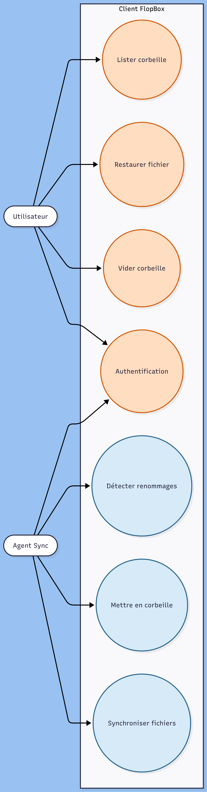
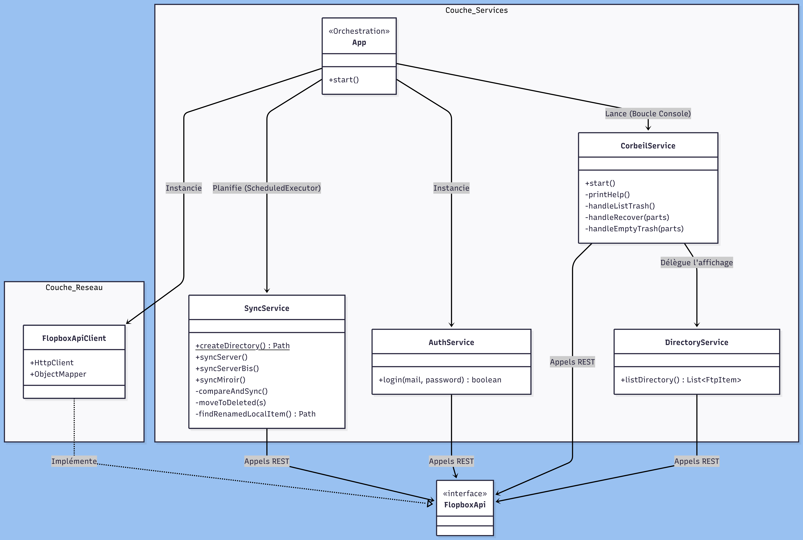
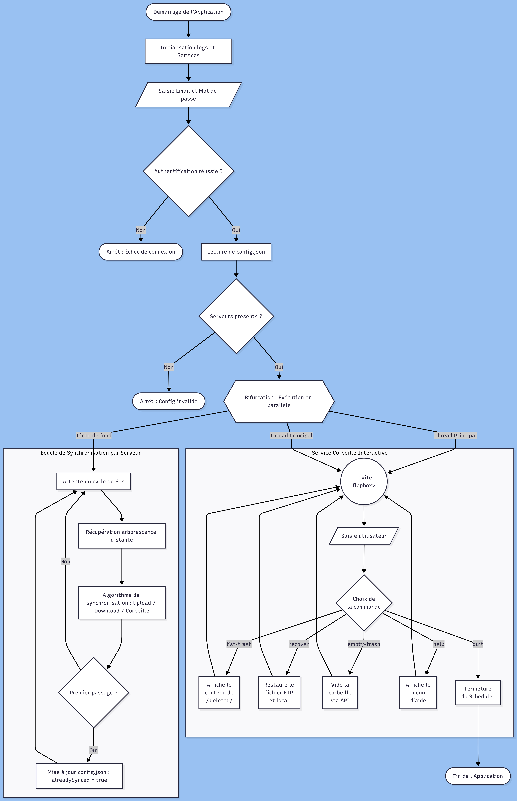
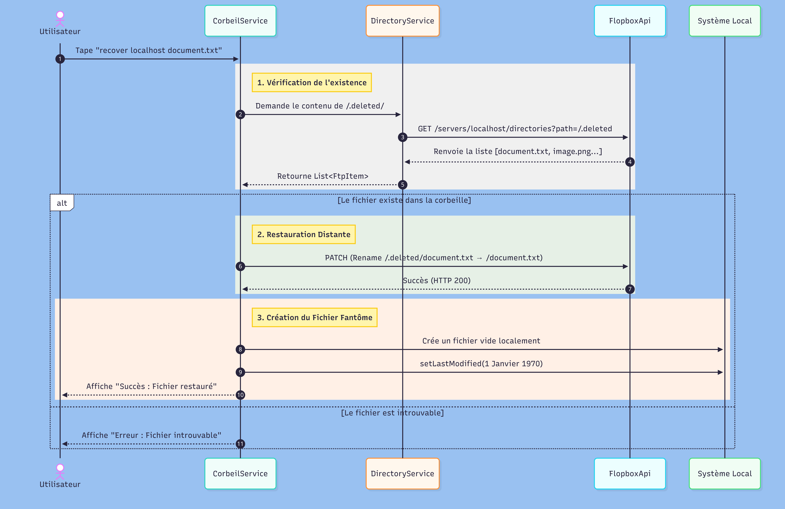

# FlopBox Client – Agent de synchronisation multi-serveurs

Application cliente Java en console qui synchronise automatiquement des serveurs FTP distants via la plateforme FlopBox, et offre un mode interactif de gestion de la corbeille distante.

---

# 📋 Sommaire

- [Fonctionnalités](#fonctionnalités)
- [Prérequis](#prérequis)
- [Configuration](#configuration)
- [Compilation et packaging](#compilation-et-packaging)
- [Lancement](#lancement)
- [Utilisation du mode interactif](#utilisation-du-mode-interactif)
- [Architecture](#architecture)
- [Conception et patterns](#Conception-et-patterns)
- [Dépendances](#dépendances)

---

# Fonctionnalités

- **Authentification sécurisée** contre le serveur FlopBox (JWT).
- **Synchronisation bidirectionnelle** multi-serveurs automatique (toutes les 60 secondes).
- **Console interactive** exécutée en parallèle pour gérer la corbeille distante (restauration, suppression définitive).
- **Détection intelligente des renommages** locaux pour éviter les transferts réseau inutiles.
- **Arrêt propre** de l’agent de synchronisation.



---

# Prérequis

- Java 21 ou ultérieur (l’application utilise `HttpClient`, les `records`, etc.)
- Maven 3.8+ (ou utiliser le wrapper Maven fourni)
- Un proxy REST FlopBox accessible (par défaut sur `http://localhost:8080`)
- Un fichier de configuration `config.json`

---

# Configuration

Créez un fichier `config.json` à la racine du projet selon ce format :

```json
{
  "servers": [
    {
      "host": "localhost",
      "username": "ftpuser",
      "password": "ftppass",
      "alreadySynced": false
    }
  ]
}
```

## Description des champs

- `host` : adresse du serveur FTP cible (utilisé comme clé pour l’API FlopBox)
- `username` / `password` : identifiants FTP
- `alreadySynced` : à la première synchronisation réussie, il passera automatiquement à `true`

---

# Compilation et packaging

```bash
./mvnw clean package
```

Le JAR exécutable sera généré dans :

```text
target/FlopboxClient.jar
```

---

# Lancement

```bash
java -jar target/target/FlopboxClient.jar
```

L'application vous demandera votre email et votre mot de passe FlopBox pour obtenir un jeton JWT, puis lira automatiquement le fichier `config.json` pour démarrer la synchronisation.

---

# Utilisation du mode interactif

Une fois l'agent de synchronisation lancé en arrière-plan, une console interactive apparaît :

```text
=======================================================
  MODE INTERACTIF : GESTION DE LA CORBEILLE (.deleted)
  Tapez 'help' pour voir les commandes disponibles.
=======================================================

flopbox>
```

## Commandes disponibles

| Commande | Description |
|---|---|
| `list-trash` | Affiche l’arborescence de la corbeille de tous les serveurs |
| `recover <host> <fichier>` | Restaure un fichier/dossier depuis la corbeille vers la racine du serveur |
| `empty-trash <host>` | Supprime définitivement le contenu de la corbeille du serveur indiqué |
| `help` | Affiche ce menu |
| `quit` / `exit` | Arrête l’agent de synchronisation et quitte proprement |

---

# Architecture

L’application suit une architecture en couches clairement séparées :




##### Ce flowchart détaille le flux d'exécution de l'application, en particulier la bifurcation majeure qui se produit au démarrage : la séparation entre la boucle de synchronisation exécutée en tâche de fond (thread secondaire) et la boucle d'interaction de la console (thread principal).



##### Ce diagramme se concentre sur un processus clé de l'application : la restauration d'un fichier depuis la corbeille. Il montre la séquence d'appels entre les différents services et l'API distante, et détaille l'astuce de la création du "fichier fantôme" pour garantir la synchronisation locale.



---
# Conception et patterns

## Architecture en couches

L’application suit une architecture stricte en couches pour garantir la séparation des préoccupations (*Separation of Concerns*) et limiter le couplage :

- **Orchestration (`App.java`)**  
  Agit comme le chef d'orchestre. Elle lit la configuration, instancie les services, et gère la séparation entre les threads de fond (`Scheduler`) et le thread principal interactif.

- **Service Layer (`SyncService`, `CorbeilService`...)**  
  Encapsule l'intelligence et les règles métier (par exemple, les algorithmes de détection de renommage).

- **Network Layer (`FlopboxApiClient`)**  
  S'occupe purement de la "tuyauterie" HTTP sans jamais connaître les règles de synchronisation.

- **State & Data (`TokenStore`)**  
  Stocke l'état volatil (le token JWT) pour toute la la durée de session de l'application.

---

## Pattern Façade / Adaptateur

L’interface `FlopboxApi` agit comme une **Façade** pour les services métiers.  
Ils l'utilisent pour interagir avec le monde extérieur sans se soucier du protocole sous-jacent.

La classe `FlopboxApiClient` agit comme un **Adaptateur** qui traduit les appels de méthodes Java en requêtes REST HTTP :
- gestion des headers
- encodage URL
- parsing JSON

---

## Pattern DTO (Data Transfer Object) via Java Records

Pour transporter les données de manière sécurisée et immuable entre l'API REST et les services locaux, l'application exploite intensivement les `records` introduits dans les versions récentes de Java :

- `FtpItem`
- `ServerCredentials`
- `RenameRequest`
- etc.

Cela garantit que les données ne sont pas altérées accidentellement pendant leur traitement en multi-threading.

---

## Injection de dépendances (Constructor Injection)

Aucun service n'instancie lui-même ses dépendances :

```java
new FlopboxApiClient()
```

Tous les services reçoivent leurs composants via leur constructeur :
- `FlopboxApi`
- `TokenStore`
- `DirectoryService`

Cela rend l'architecture extrêmement modulaire et facilite grandement les tests unitaires via la création de mocks (avec Mockito).

---

# Points techniques clés

## 1. Exécution multi-threadée (Background vs Console)

Le défi principal de l'agent est de pouvoir surveiller les serveurs en permanence sans geler l'interface utilisateur.

Un `ScheduledExecutorService` est utilisé pour créer un pool de threads dédié aux tâches de fond.

La console interactive s'exécute, quant à elle, de manière bloquante sur le thread principal.

```java
// App.java : Allocation d'un thread par serveur
ScheduledExecutorService scheduler =
        Executors.newScheduledThreadPool(config.servers().size());

for (ServerCredentials server : config.servers()) {

    // Tâche planifiée toutes les 60 secondes
    scheduler.scheduleAtFixedRate(() -> {
        syncService.syncServer(...);

    }, 0, 60, TimeUnit.SECONDS);
}

// Le thread principal est ensuite accaparé par la console interactive
corbeilService.start();
```

---

## 2. L’astuce du « fichier fantôme » pour la restauration

Il existe un risque de *Race Condition* :

Si l'utilisateur restaure un fichier distant (sortie de la corbeille), le `SyncService` (en tâche de fond) pourrait se réveiller, ne pas voir le fichier localement, et en déduire que l'utilisateur veut le supprimer à nouveau.

Pour pallier cela, le `CorbeilService` crée un fichier local temporaire avec une date "Epoch" (`1er Janvier 1970`).

Au cycle suivant, l'agent constatera que le serveur est plus récent et le téléchargera automatiquement.

```java
// CorbeilService.java : sortie de corbeille distante
api.renameFile(
        tokenStore.get(),
        host,
        new RenameRequest(oldPath, newPath)
).join();

// Création du "fantôme" local
File localGhost =
        new File("flopbox_data/" + host + "/" + fileName);

localGhost.getParentFile().mkdirs();
localGhost.createNewFile();

// Manipulation du timestamp
localGhost.setLastModified(0L);
```

---

## 3. Optimisation des performances via E/S Asynchrones

Si les appels légers (comme lister les dossiers) sont synchrones, les opérations lourdes (transferts de fichiers) utilisent les E/S non bloquantes de `HttpClient` (`sendAsync`), renvoyant des `CompletableFuture`.

Cela empêche le verrouillage des threads pendant les fluctuations réseau.

```java
// FlopboxApiClient.java : téléchargement asynchrone
@Override
public CompletableFuture<Void> downloadFile(...) {

    return httpClient.sendAsync(
            request,
            HttpResponse.BodyHandlers.ofInputStream()
    ).thenAccept(response -> {

        try (InputStream is = response.body()) {

            Files.copy(
                    is,
                    localPath,
                    StandardCopyOption.REPLACE_EXISTING
            );

        } catch (IOException e) {
            log.error("Écriture impossible", e);
        }
    });
}
```

---

## 4. Alignement rigoureux des timestamps

Lorsqu'un fichier est téléchargé, le système d'exploitation lui attribue automatiquement l'heure de téléchargement comme date de modification.

Cela déclencherait une fausse alerte de mise à jour au cycle suivant.

L'application parse donc la date FTP distante et l'injecte de force dans les métadonnées du fichier local fraîchement téléchargé.

```java
// FlopboxApiClient.java : alignement des horloges
long remoteTime =
        ZonedDateTime.parse(
                remoteFile.lastModified(),
                FTP_DATE_FORMAT
        ).toInstant().toEpochMilli();

Files.setLastModifiedTime(
        localPath,
        FileTime.fromMillis(remoteTime)
);
```

---

## 5. Algorithme heuristique pour la détection de renommage

Pour éviter d'uploader un fichier lourd simplement parce qu'il a été renommé localement, le `SyncService` embarque une heuristique.

Avant de supprimer un fichier côté serveur, il cherche si un fichier "orphelin" (non présent sur le FTP) possède exactement :
- la même taille
- la même date de modification

Une tolérance de `2000 ms` est appliquée pour compenser l'imprécision inhérente au protocole FTP et aux systèmes de fichiers.

```java
// SyncService.java : logique extraite de findRenamedLocalItem()

if (Files.size(localItem) != remoteItem.size()) continue;

long remoteTime =
        ZonedDateTime.parse(
                remoteItem.lastModified(),
                FTP_DATE_FORMAT
        ).toInstant().toEpochMilli();

long localTime =
        Files.getLastModifiedTime(localItem).toMillis();

// Tolérance pour les horloges FTP / OS
if (Math.abs(localTime - remoteTime) > 2000) continue;

return localItem; // fichier renommé détecté

```
---

# dépendances

```xml
        <!-- pour le mapping des objet -->
        <dependency>
            <groupId>com.fasterxml.jackson.core</groupId>
            <artifactId>jackson-databind</artifactId>
            <version>2.17.0</version>
        </dependency>

        <!-- interface pour les log -->
        <dependency>
            <groupId>org.slf4j</groupId>
            <artifactId>slf4j-api</artifactId>
            <version>2.0.17</version>
            <scope>compile</scope>
        </dependency>

        <!-- implémentation pour les log -->
        <dependency>
            <groupId>ch.qos.logback</groupId>
            <artifactId>logback-classic</artifactId>
            <version>1.5.31</version>
            <scope>compile</scope>
        </dependency>

        <!-- framework pour les tests -->
        <dependency>
            <groupId>org.junit.jupiter</groupId>
            <artifactId>junit-jupiter</artifactId>
            <version>5.10.0</version>
            <scope>test</scope>
        </dependency>
        <!-- pour mocker des objets pour les tests -->
        <dependency>
            <groupId>org.mockito</groupId>
            <artifactId>mockito-core</artifactId>
            <version>5.5.0</version>
            <scope>test</scope>
        </dependency>
```